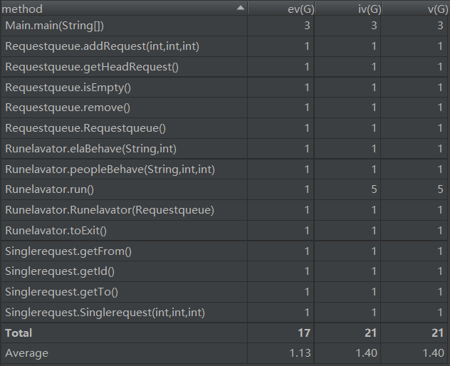
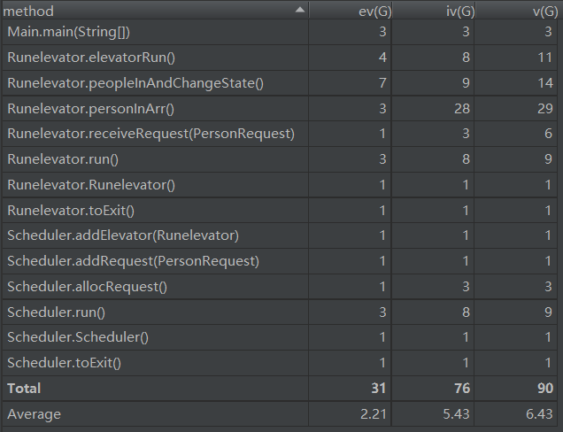
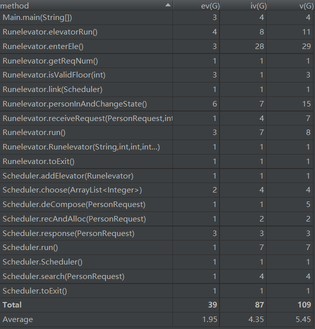
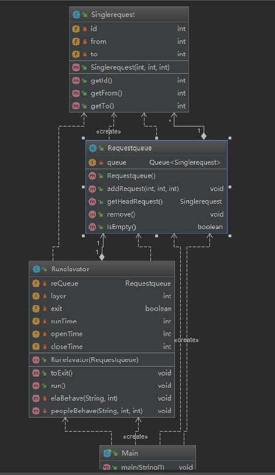
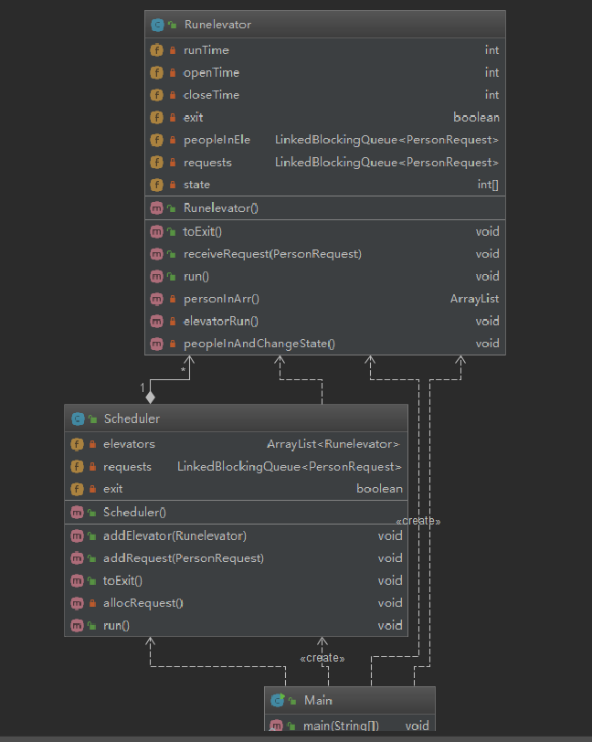
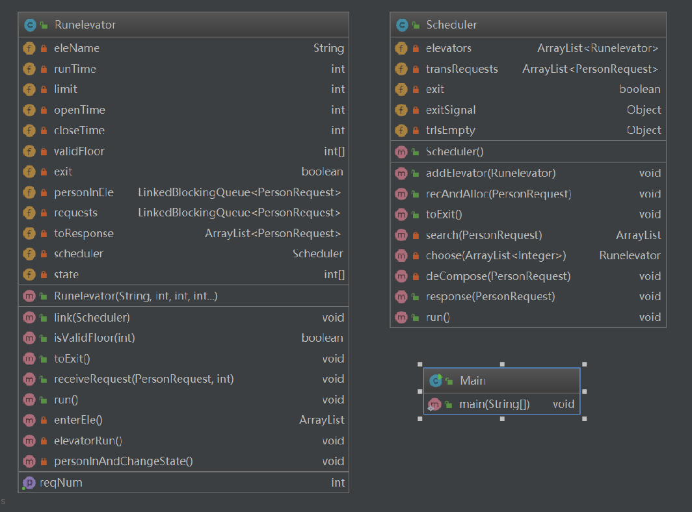
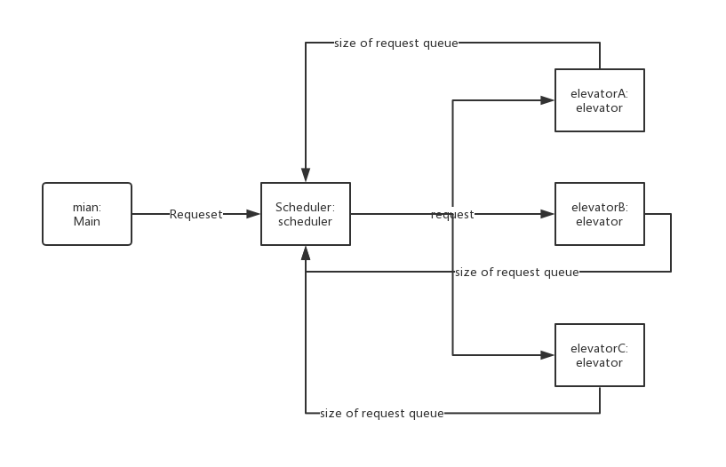

# 面向对象设计与构造：电梯单元作业总结

## 第一部分：设计策略

**第一次作业实现简单调度：处理完一个请求再去处理下一个，强测100**

**第二次作业实现运送捎带：电梯捎带策略没能保证线程安全，强测30**

**第三次作业实现电梯协同：调度器分派请求，电梯自捎带并完成调度器分派的所有请求，强测94**

但最开始我的想法是：**当前楼层电梯满载时，把该请求返还调度器，进行再分派**。经过分析后我决定放弃该思路：

- 电梯返还请求给调度器，调度器线程的工作时间大大增加。
- 创建状态查询接口给调度器，维护线程安全的工作量较大，稍不注意就可能出现调度错误。
- 问题的焦点主要在于**返还调度器**和**自捎带**的时间开销比较，对于大量的随机数据返还调度器不一定高效可靠。

##### 调度器逻辑：

- 请求的出发楼层和到达楼层均在一个电梯的可达楼层集合内，即分配给相应电梯
- 以第一层和第十五层为**分派转接站**，对转接请求进行分解

##### 电梯自捎带的逻辑：

**（虚线框内的操作需对两队列对象加锁，其余时间均可接受来自调度器的分派请求）**


##### 设计优缺点：

- **优点**：**基本维护了线程安全**，能在有效时间内解决所有请求

- **缺点**：

  + 我的设计使得调度器本不必构造为线程，在扩展调度算法的部分可扩展性较低

  - 对于第三次作业，如果输入**大量只由同一电梯能完成的请求**，那么其他两电梯空闲时间较长，即使通过电梯自捎带策略可以在规定时间内完成调度作业，性能却较低
  - 作业三仍只用了三个类实现，没有做到对行为和共享数据的合理抽象。大量**if-else代码逻辑**无法优化，结构清晰度度较低。并且数据结构的运用生疏，尤其是可以构造**优先队列**的场景，我都只用了for实现

## 第二部分：基于度量的程序结构分析

#### 横向对比

​	**Metrics**

- **homework_one**

​	

- **homework_two**



- **homework_three**

    

**关键指标**

- **ev(G)**：程序非结构化程度，数值高低影响模块化和维护
- **iv(G)**： 模块设计复杂度，数值高低影响模块耦合度
- **v(G)**：  模块判定结构复杂度

三次作业对比：

- 第三次作业较第二次作业，程序结构化程度，模块耦合度和结构复杂度有所改进
- 作业二和作业三的方法enterEle方法的设计复杂度较高，该方法的实例代码采用了了**大量if-else逻辑和for循环**，没有能够进行合理的剪枝与优化
- 随着问题复杂度的增加，我的程序逐渐减少了RUN方法中的细节展现，细化了处理函数

**类图分析**

- **homework_one**



- **homework_two**

  

- **homework_three**

  

三次作业对比：

- 第一次作业初步尝试编写线程安全的程序，对电梯的状态属性采用**volatile**，对查询与修改进行了加锁
- 第二次作业引入了调度器模块，对电梯的状态和电梯需要解决的请求队列和电梯内人员队列进行了维护，引入阻塞队列保障线程安全
- 第三次作业我仍只创建了三个类，**电梯类和调度器类的代码行数均在200行以内**，但这次作业类属性个数明显增加，对大部分的属性变量都采用**volatile**进行了维护

#### UML协作图



**基于设计：**

+ 主线程将输入接收到的请求扔进**scheduler的请求队列池**
+ 电梯返还当前**需解决的请求队列大小**
+ 调度器首先根据请求**判定能分派给哪些电梯**，获取这些电梯的请求队列长度，根据**任务均化原则**分派任务

#### 基于SOLID原则的评价

　　**SRP（单一责任原则）：避免类的功能重合和一个类做太多事。**我的三次作业并没有很好地满足这一原则，甚至第三次作业我仍只用了三个类完成调度。只单纯地抽象出电梯，调度器，输入三类线程，由每个类实现自己的功能，但电梯和调度器类做了太多的事情，戏称**智能电梯。**

　　**OCP（开放封闭原则）：对扩展开放，对修改封闭。**一是我采用**Thread类创建线程**，对于电梯和调度器不能再继承其他类，可扩展性较差。二是我的电梯类中封装了**特定的行为方法**，并没有把所有电梯都具有的属性和行为单独封装为一个父类，需求的更改会导致代码的重构。

　　**LSP（里氏替换原则）：子类应该包括父类的所有属性。**设计没有出现继承。

　　**ISP（接口分离原则）：避免接口的责任重合和一个接口做太多事情。**作业不涉及接口问题。 

　　**DIP（依赖倒置原则）：模块之间尽可能依赖于抽象实现，而不是模块之间的依赖，抽象不能依赖于细节。**这个单元的作业没有能够有效降低模块之间的耦合度，没有尝试**基于抽象类的代码设计模式**。

## 第三部分：BUG分析

*作业一和作业三的公测用例全部通过*

#### 作业二的公测BUG

**CPU_TIME_LIMIT_EXCEED**

```
测试样例1:
[0.0]0-FROM-5-TO-1
[0.0]1-FROM-1-TO-16
```

**错误定位**

```java
//main.java:
Scheduler scheduler = new Scheduler();
Runelevator elevatorOne = new Runelevator(); //create an elevator thread
scheduler.addElevator(elevatorOne); //add elevatorOne to scheduler
scheduler.start();//scheduler begins to work

ElevatorInput elevatorInput = new ElevatorInput(System.in);
TimableOutput.initStartTimestamp();
while(true){
    PersonRequest request = elevatorInput.nextPersonRequest();
    ...
}
```

**错误原因：**没有弄清**start方法为异步方法**，在调度器中调用电梯的start。导致在开始时刻有请求到来时，电梯可能没有完成初始化，轮询使得CPU超时

**REAL_TIME_LIMIT_EXCEED**

```
测试样例2:
[10.0]11-FROM--1-TO-15
[10.0]12-FROM--1-TO-14
[10.0]13-FROM--1-TO-13
[12.0]14-FROM--1-TO-12
```

**错误定位**

```java
//runElevator.java:
private synchronized void openAndClose() throws InterruptedException {
        ...
    	for (PersonRequest req : requests) {
            if (req.getFromFloor() == currentFloor) {
                personIn.add(req);
            }
        }
    	...
}
```

**错误原因：**在openAndClose函数中对于当前能够进入电梯的请求筛选，只简单地将当前楼层和请求出发楼层进行对比，没有考虑电梯运行方向的问题，**以至于出现一部分人一直在电梯里打转**，很长时间没有能够出去。同时，**在同一时间发出的请求没有载上，更是因为该函数对当前线程对象加锁，以至于后面的请求无法传入，出现输入阻塞的情况。**

*以上是公测BUG的典型，在修改了上述问题后，能够通过测试，但重构太多无法合并修复*

#### BUG与设计结构的关联性

- 首先想弄清楚电梯的捎带逻辑，在对捎带请求的处理上有些**想当然**

- **估计CPU计算时间**是出错的一大原因，无法确定当前时刻哪一线程会被调度


## 第四部分：Hack策略

第二次作业没有进入互测，第一次和第三次作业没有hack成功，原因如下：

+ 在不清楚代码的逻辑结构前，盲目的随机测试最多只能炸出**异常**
+ **定时投放**无法完全达到想要的效果，**调试具有不可复现性**，需要设计程序判断结果正确性

我设计的判断结果正确性的代码逻辑：

> **1.以人员ID为索引检索输出结果，与输入进行比对，看是否到达目的楼层
> 2.分别检查三个电梯的行为：
> 	a.提取输出结果中对应电梯的相关语句(包括人和电梯)，插入对应的队列
> 	b.检索队列中OPEN和CLOSE间有无ARRIVE,OPEN,CLOSE相关操作，并检查开关门时间是否达到要求
> 	c.检索队列中CLOSE和下一次OPEN之间有无相关人员出入操作
> 	d.检索相邻ARRIVE是否满足时间要求
> 3.检查人员的行为：
> 	a.以ID为索引，将同一个人的出入行为依次加入队列
> 	b.判断队列是否以IN,OUT间隔，检查IN和OUT间隔时间是否小于最低要求**

我认为中测已检查了**满载和超时**的情况，因此没有加入对它们的判断。因为**不同的人有不同的调度方式**，我的结果正确性判断代码仍存在漏洞，但能解决大部分显式行为错误，只可惜没找到BUG 

## 第五部分：心得体会

**知识层面**

- 线程无法在代码逻辑中确定其状态。start是异步方法，开启线程需注意线程安全
- ArrayList线程不安全，vector线程安全，以及阻塞队列的实现方式
- 要分清线程内的行为功能，是完成自己的事情，还是通过共享资源与其他进程进行交互
  - 父子关系:创建和启动线程
  - 协作关系:生产者和消费者
  - 同步关系:通过共享对象或者主动状态控制进行同步
- RUN方法结构逻辑需要简明清晰，展现更少的细节，而在方法中去实现访问的控制
- 当需要在线程中相互调用时，考虑**构造Tray**来对共享资源进行访问控制，如**管程**

**设计心得**

- **永远不要假设具体的执行顺序**：我的作业二之所以出现线程安全问题主要是因为估计CPU计算时间，作业三改进不再尝试去**挑战CPU**，而是**规规矩矩做好同步与互斥**
- **找到真正不相关的计算任务**：在作业二时还不知道**JAVA重入锁**机制，以至于我对接受请求的方法加锁，对开关门方法也进行了加锁，两方法执行互斥，也就导致有些情况下无法接受多个同一时间输入的请求。而方法代码中有一大部分是不相关的处理任务，我并没有把它们提取出来。
- **程序执行的顺序按照代码的先后顺序：**我的作业二在考虑共享数据(请求队列)的读写访问时，**做了太多无谓的假设逻辑顺序**，恰恰忽略了一个线程中代码执行的先后顺序。

**附上学习过程中的多线程笔记：**


